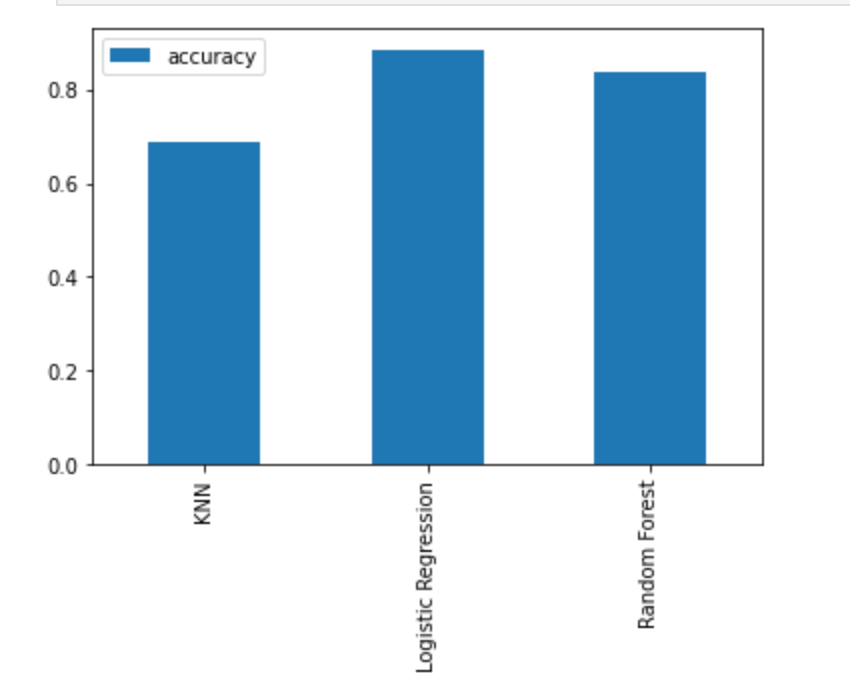
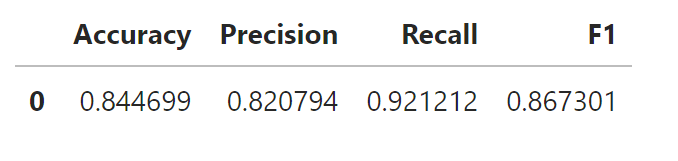

# Heart-Disease-Classification Project

## Aim of the project
#### Given medical patient's attributes, is it possible for a Machine Learning model to predict whether or not the patient has a heart disease?

## Dependencies installation
#### pip install pandas
#### pip install scikit-learn
#### pip install matplotlib
#### pip install numpy

## Results
#### Best model :LogisticRegression (with tunned hyperparameters using GridSearchCV).

## About the data
#### The original data set come frome the "https://archive.ics.uci.edu/dataset/45/heart+disease"

## Model Comparison

#### Classification report:

## How to use the trained model?
#### To use the trained model (use 'joblib'):
##### * from joblib import load
##### * load(filename= 'trained_model.joblib')
##### It is imported you can now use it to make predictions!!
